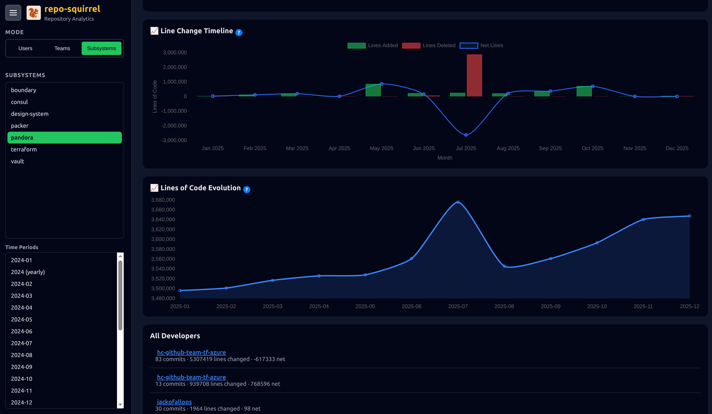
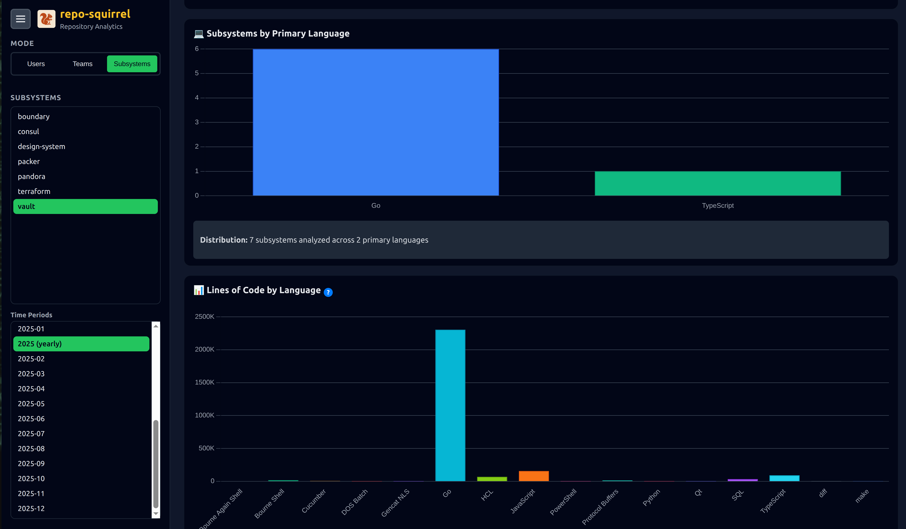
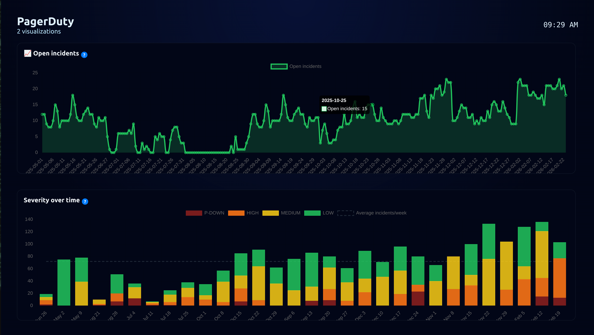

# Git Repository Squirrel 🐿️

> 🆕 **Live Demo**: https://demo.reposquirrel.com:8443 — Explore RepoSquirrel using a couple public HashiCorp repositories. The demo omits team-specific setup (since we don’t know their org structure) but showcases what you can expect before installing locally.

> ⚠️ Demo environment is for viewing only (read-only) and uses real Git history from open-source HashiCorp projects. Access it via HTTPS at https://demo.reposquirrel.com:8443.


**🐳 Quick Docker Run**
```bash
docker run -p 5000:5000 -v repos:/app/repos -v stats:/app/stats -v configuration:/app/configuration ghcr.io/reposquirrel/reposquirrel:latest
```

A comprehensive Git repository analytics tool that provides detailed insights into developer contributions, subsystem ownership, and codebase evolution over time. Perfect for understanding who owns what in large, multi-repository codebases. Also integrates with for example pagerDuty to give helicopter view of the developement and support activities.




## Features

### 📊 Developer Analytics
- **Contribution tracking** - Lines added, removed, and modified per developer
- **Historical analysis** - Monthly and yearly statistics
- **Ownership metrics** - Current code ownership via git blame analysis
- **Team organization** - Group developers into teams for collective insights


### 🔧 Subsystem/Service Analysis
- **Multi-repository support** - Analyze multiple repositories simultaneously
- **Subsystem breakdown** - Track contributions to specific services or components
- **Path-based filtering** - Define services by directory paths
- **Unified statistics** - Aggregate data across related subsystems



### 🎯 Advanced Features
- **Blame analysis** - Full repository ownership tracking
- **User aliases** - Consolidate statistics for users with multiple Git identities
- **Ignore lists** - Filter out bots and automated accounts
- **Language detection** - Track contributions by programming language
- **Interactive dashboard** - Web-based UI for exploring data
- **Real-time updates** - Live progress tracking for long-running analyses

### 🖥️ Kiosk Mode
Loop curated repo metrics and/or PagerDuty responders on hallway displays via `/kiosk`



### 🚨 PagerDuty Alerts
- **Alerts mode** - A dedicated dashboard tab that visualizes your PagerDuty incidents alongside repo metrics
- **Automatic ingestion** - Configure an API token once and every “Run Update” pull grabs the last 12 months of incidents
- **Ready-made charts** - Open incident history, opened vs closed trends, severity mix, and quick lists of active/recent incidents
- **Responder leaderboard & dashboards** - Match PagerDuty resolvers to developer profiles, jump to their RepoSquirrel user page, and drill into per-responder PagerDuty timelines

📘 See the [PagerDuty integration guide](docs/pagerduty_integration.md) for setup steps and screenshots of the new workflows.


## Getting Started

- **One-line Docker run** (recommended) is shown above for the quickest path to a working dashboard.
- For manual setup, dependency installation, configuration file formats, project structure, and Docker/Makefile workflows, see the [Development Guide](docs/development_guide.md).
- Once running, visit `http://localhost:5000` to configure repositories, teams, subsystems, aliases, and to launch “Run Update” jobs.


## Screenshots

### Detailed Developer View


### Linux Kernel Analysis


## Use Cases

- **Code ownership tracking** - Who owns what parts of the codebase?
- **Team performance metrics** - How much is each team contributing?
- **Subsystem health** - Which components are actively maintained?
- **Historical analysis** - How has contribution changed over time?
- **Onboarding insights** - Who are the experts in each area?
- **Resource planning** - Where is development effort being spent?
- **Kiosk mode ** - Show visualizations / alerts in the developement room or management area, based on git or pagerDuty
## License

This project is licensed under the **GNU Affero General Public License v3.0 (AGPL-3.0)**.

See [LICENSE](LICENSE) for details.

If you need commercial terms that avoid the obligations of the AGPL, please review [COMMERCIAL_LICENSE_EXCEPTIONS.md](COMMERCIAL_LICENSE_EXCEPTIONS.md).

## Contributing

Contributions are welcome! Please feel free to submit issues and pull requests.

For environment setup, configuration formats, and Docker/Makefile workflows, see the [Development Guide](docs/development_guide.md).

## Support

For questions or issues, please open an issue on the project repository.

