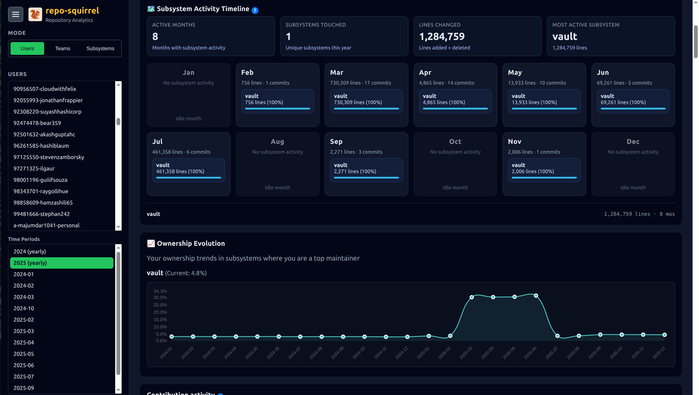
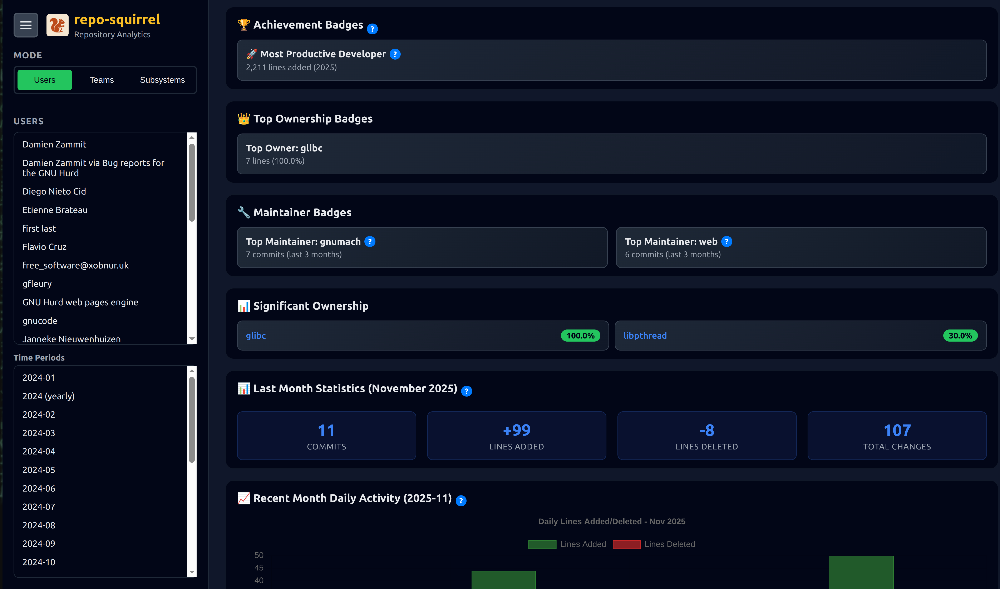
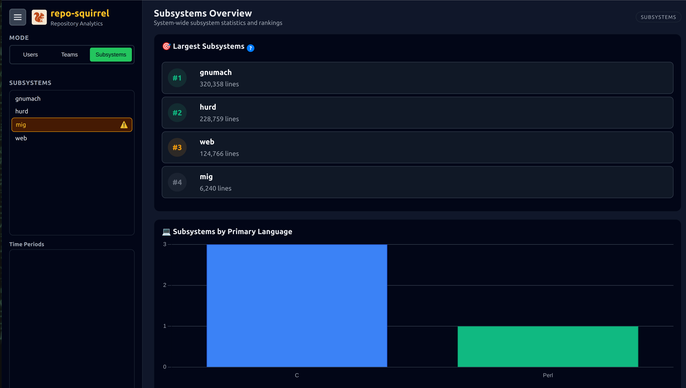
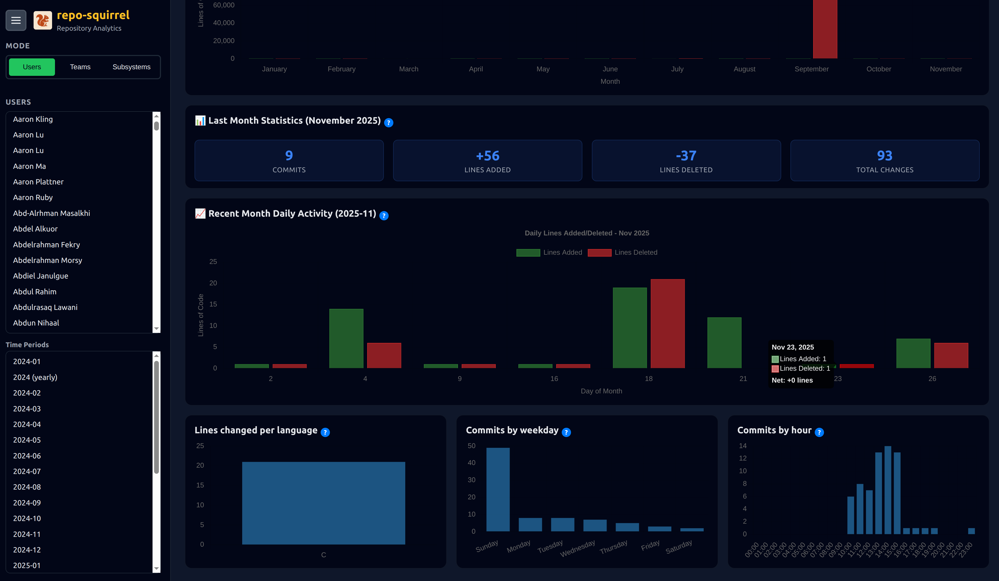
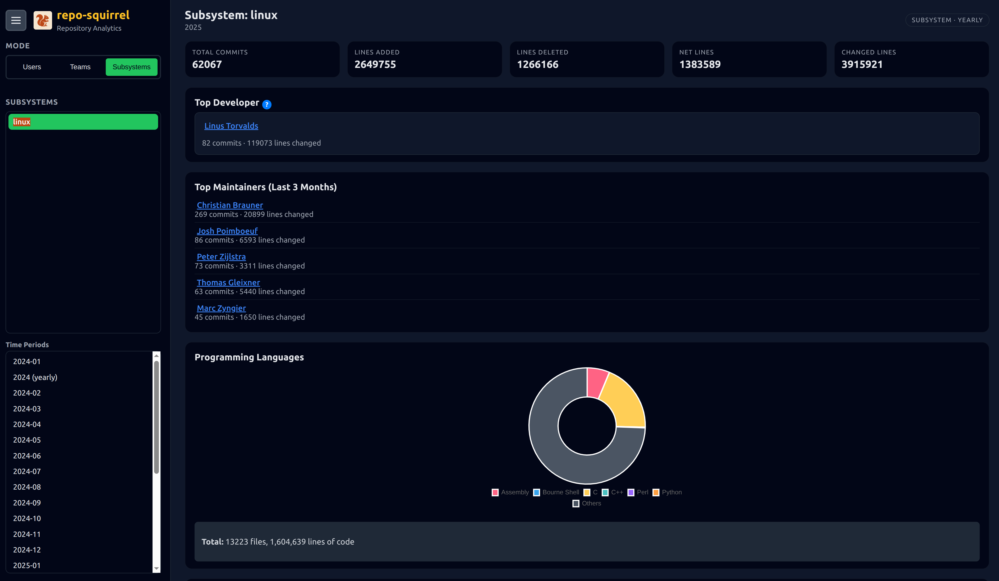
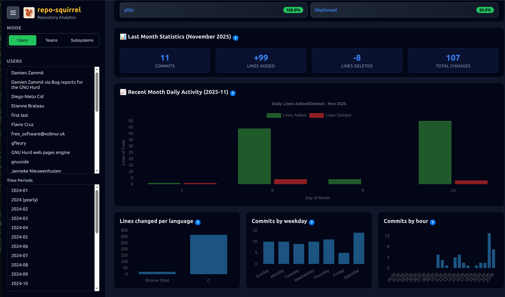
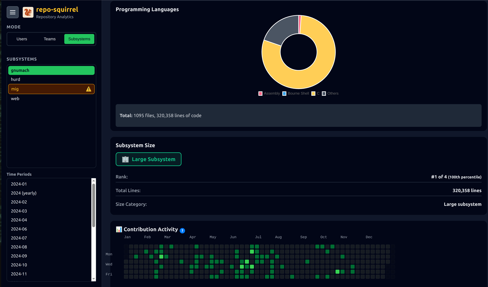
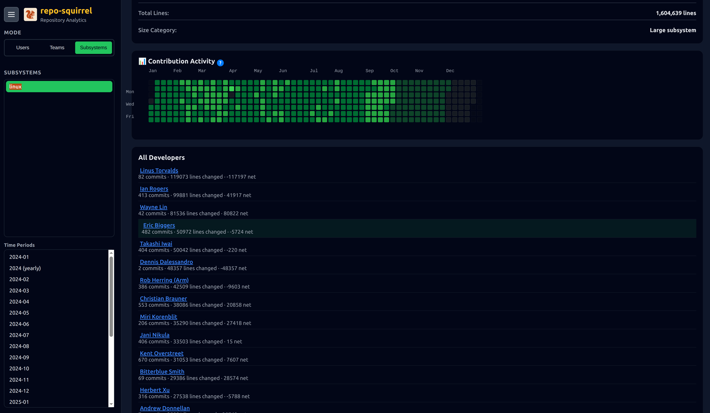

# Git Repository Squirrel 🐿️

> 🆕 **Live Demo**: http://13.61.92.173:5555 — Explore RepoSquirrel using a couple public HashiCorp repositories. The demo omits team-specific setup (since we don’t know their org structure) but showcases what you can expect before installing locally.

> ⚠️ Demo environment is for viewing only (read-only) and uses real Git history from open-source HashiCorp projects.

A comprehensive Git repository analytics tool that provides detailed insights into developer contributions, subsystem ownership, and codebase evolution over time. Perfect for understanding who owns what in large, multi-repository codebases.



## Features

### 📊 Developer Analytics
- **Contribution tracking** - Lines added, removed, and modified per developer
- **Historical analysis** - Monthly and yearly statistics
- **Ownership metrics** - Current code ownership via git blame analysis
- **Team organization** - Group developers into teams for collective insights



### 🔧 Subsystem/Service Analysis
- **Multi-repository support** - Analyze multiple repositories simultaneously
- **Subsystem breakdown** - Track contributions to specific services or components
- **Path-based filtering** - Define services by directory paths
- **Unified statistics** - Aggregate data across related subsystems



### 🎯 Advanced Features
- **Blame analysis** - Full repository ownership tracking
- **User aliases** - Consolidate statistics for users with multiple Git identities
- **Ignore lists** - Filter out bots and automated accounts
- **Language detection** - Track contributions by programming language
- **Interactive dashboard** - Web-based UI for exploring data
- **Real-time updates** - Live progress tracking for long-running analyses



## Requirements

### System Requirements
- **Python 3.7+**
- **Git** - Must be installed and accessible from command line
- **cloc** - Count Lines of Code tool for language detection and statistics
- **Unix-like environment** - Linux or macOS recommended (Windows with WSL should work)

### Installing cloc

**Ubuntu/Debian:**
```bash
sudo apt-get install cloc
```

**macOS (Homebrew):**
```bash
brew install cloc
```

**Fedora/RHEL:**
```bash
sudo dnf install cloc
```

**From source:**
```bash
# Download and install from https://github.com/AlDanial/cloc
```

**Note:** The tool will still work without `cloc`, but language statistics will show as "Unknown".

### Python Dependencies
```
flask
```

Install with:
```bash
pip3 install flask
```

## Quick Start

### 1. Install Dependencies
```bash
# Install system dependencies
sudo apt-get install git cloc  # Ubuntu/Debian
# or
brew install git cloc          # macOS

# Install Python dependencies
pip3 install flask
```

### 2. Clone and Start
```bash
git clone <repository-url>
cd reposquirrel
python3 dashboard_server.py
```

### 3. Configure via Web UI
Open your browser to `http://localhost:5000`

From the dashboard, you can:
- **Clone repositories** - Add Git repositories directly through the UI
- **Configure teams** - Set up developer teams and members
- **Define subsystems** - Map repositories to services/components
- **Set up aliases** - Consolidate user identities
- **Generate analytics** - Run analysis for specific time periods
- **View statistics** - Browse developer and subsystem insights



**That's it!** All configuration and repository management can be done through the web interface.

## Docker & Makefile Workflow

You can containerize repo-squirrel with the included `Dockerfile` and `Makefile`.

### Build the image
```bash
make build IMAGE=repo-squirrel TAG=latest
```

### Run the dashboard
```bash
make run IMAGE=repo-squirrel TAG=latest PORT=5001 \
  REPO_DIR=$PWD/repos STATS_DIR=$PWD/stats CONFIG_DIR=$PWD/configuration
```

This maps the host directories into the container so repository clones, generated stats, and configuration overrides live on your filesystem. Toggle read-only mode by setting `READ_ONLY=true`:
```bash
make run READ_ONLY=true
```

### Exporting the image
To move the built container to another machine:
```bash
make save IMAGE=repo-squirrel TAG=latest SAVE_FILE=reposquirrel.tar.gz
scp reposquirrel.tar.gz other-host:/path/
```
Load it on the target box:
```bash
gunzip -c reposquirrel.tar.gz | docker load
```

You can also run the container manually:
```bash
docker run --rm -it \
  -p 5001:5001 \
  -e PORT=5001 -e READ_ONLY=false \
  -v $PWD/repos:/app/repos \
  -v $PWD/stats:/app/stats \
  -v $PWD/configuration:/app/configuration \
  repo-squirrel:latest
```

## Usage

### Web Dashboard

The dashboard provides an interactive interface for exploring your analytics data.

**Starting the server:**
```bash
python3 dashboard_server.py
```

**Features:**
- Browse developer statistics and contributions
- View subsystem ownership and trends
- Explore team performance
- Configure repositories and teams through the UI
- Real-time progress for data generation



## Configuration

Configuration files are stored in the `configuration/` directory. You can edit them manually or through the web dashboard.

### services.json
Defines how repositories are organized into services/subsystems:

```json
{
  "repo-name": {
    "service1": ["service1/"],
    "service2": ["service2/"],
    "main": [""]
  }
}
```

### teams.json
Organizes developers into teams:

```json
{
  "team-id": {
    "name": "Team Display Name",
    "description": "Team description",
    "members": ["user1", "user2", "user3"]
  }
}
```

### alias.json
Maps alternative usernames to canonical names:

```json
{
  "canonical-username": ["alias1", "alias2"],
  "other-user": ["alternative-name"]
}
```

### team_subsystem_responsibilities.json
Links teams to subsystems they own:

```json
{
  "team-id": ["subsystem1", "subsystem2"],
  "other-team": ["subsystem3"]
}
```

### ignore_user.txt
List of usernames to exclude (one per line):
```
bot-account
automated-user
ci-bot
```

## Project Structure

```
GIT_REPO_SQUIRREL_NEW/
├── master.py                 # Main orchestration script
├── dashboard_server.py        # Web dashboard server
├── summery.py                 # User statistics generator
├── service.py                 # Subsystem statistics generator
├── blame.py                   # Ownership analysis via git blame
├── repo.py                    # Repository utilities
├── configuration/             # Configuration files
│   ├── services.json
│   ├── teams.json
│   ├── alias.json
│   ├── team_subsystem_responsibilities.json
│   └── ignore_user.txt
├── templates/                 # HTML templates for dashboard
├── static/                    # CSS, JavaScript for dashboard
├── repos/                     # Your cloned repositories go here
└── stats/                     # Generated analytics (created automatically)
```

## How It Works

1. **Repository Scanning** - The tool scans Git repositories in the specified directory
2. **Commit Analysis** - For each month, it analyzes commits using `git log` with statistics
3. **Attribution** - Commits are attributed to developers, with alias resolution
4. **Subsystem Mapping** - Files are mapped to services/subsystems based on configuration
5. **Blame Analysis** - `git blame` determines current ownership of each line of code
6. **Aggregation** - Data is aggregated by user, team, subsystem, and time period
7. **Dashboard** - Web interface provides interactive exploration of the data

## Screenshots

### Detailed Developer View


### Linux Kernel Analysis


## Use Cases

- **Code ownership tracking** - Who owns what parts of the codebase?
- **Team performance metrics** - How much is each team contributing?
- **Subsystem health** - Which components are actively maintained?
- **Historical analysis** - How has contribution changed over time?
- **Onboarding insights** - Who are the experts in each area?
- **Resource planning** - Where is development effort being spent?

## License

This project is licensed under the **Creative Commons Attribution-NonCommercial-ShareAlike 4.0 International License**.

See [LICENSE](LICENSE) file for details.

For commercial use exceptions, see [COMMERCIAL_LICENSE_EXCEPTIONS.md](COMMERCIAL_LICENSE_EXCEPTIONS.md).

## Contributing

Contributions are welcome! Please feel free to submit issues and pull requests.

## Support

For questions or issues, please open an issue on the project repository.

