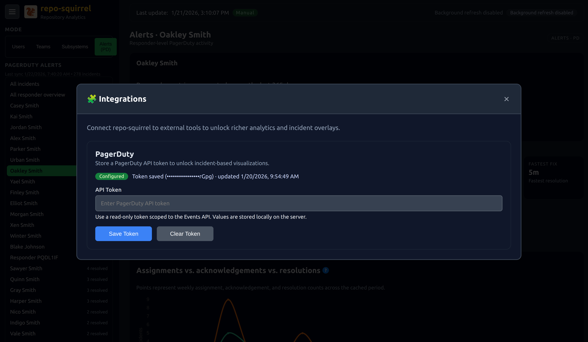
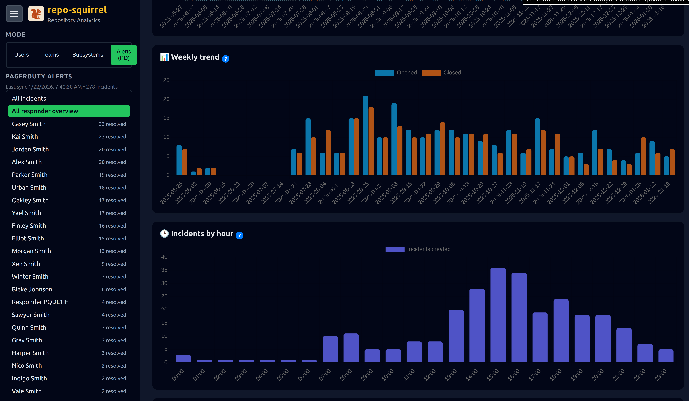
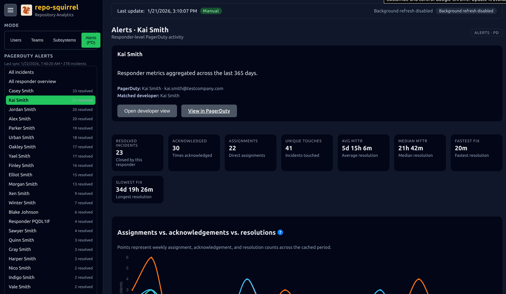
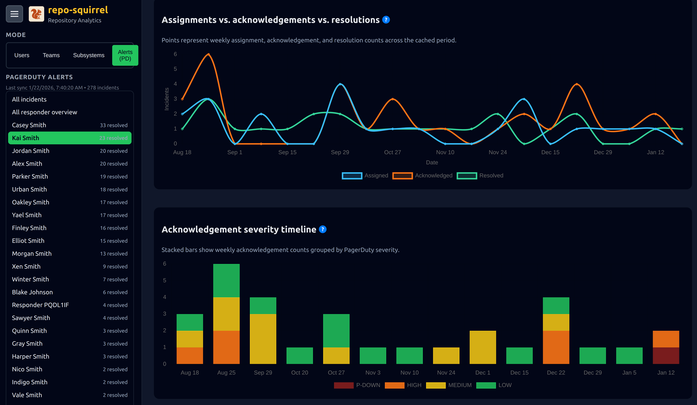

# PagerDuty Integration

## Overview
The PagerDuty integration brings alerting insights into Repo Squirrel by ingesting up to one year of incident history and surfacing it directly inside the dashboard experience. It links PagerDuty responders to Git users, enabling end-to-end views of who is handling incidents, how often, and with what outcomes.

## Configuration & Authentication
Use the **Integrations** option in the hamburger menu to open the dedicated dialog and enter your PagerDuty API token.

## Data Ingestion
Running **Run Update** (from the hamburger menu or by executing `python master.py --pagerduty-only`) pulls the latest ncidents, responders, assignments, acknowledgements, resolutions, and severity metadata.

## UI Tour
### Alerts (PD) mode
Selecting **Alerts (PD)** from the mode switch reveals high-level PagerDuty analytics, including severity-over-time charts with weekly aggregation, day-of-week patterns, active-incident filters, and responder leaderboards. A floating average line helps highlight weeks that are above or below the long-term incident volume.

### All Responders Overview
This view lists all responders matched to Git if availble, ranking them by involvement. Each card exposes quick stats, severity distributions, and action buttons: **Details** opens that responder’s dashboard and **PagerDuty** links out to their profile. Filters let you narrow active incidents by severity, status, or search terms, while summary widgets break down incident counts by severity bucket.

### Responder Detail Dashboards
Clicking a responder loads an individual workspace featuring:
- Assignment, acknowledgement, and resolution timelines (weekly, color-coded by severity)
- Active incidents assigned to the responder, plus quick filters
- Incident history tables with search, severity filters, and deep links to PagerDuty
- Time-of-day inflow charts plus responder-specific statistics

### All Incidents Explorer
The **All incidents** entry in the left navigation surfaces a searchable, filterable list of every incident (open or resolved). A stacked-bar timeline at the top reacts to the current filters so you can instantly see how incident volume changes by severity as you refine the dataset.

All in all, a convinent way of having a helicopter view of the alerts, in many ways from my own opinion better dashboard then the one in the tool.

### Kiosk Mode Displays
PagerDuty metrics can also run in Repo Squirrel's `/kiosk` hallway display mode so on-call teams can monitor live incidents without interacting with the dashboard.

Would love some additional screenshots here, from live systems
